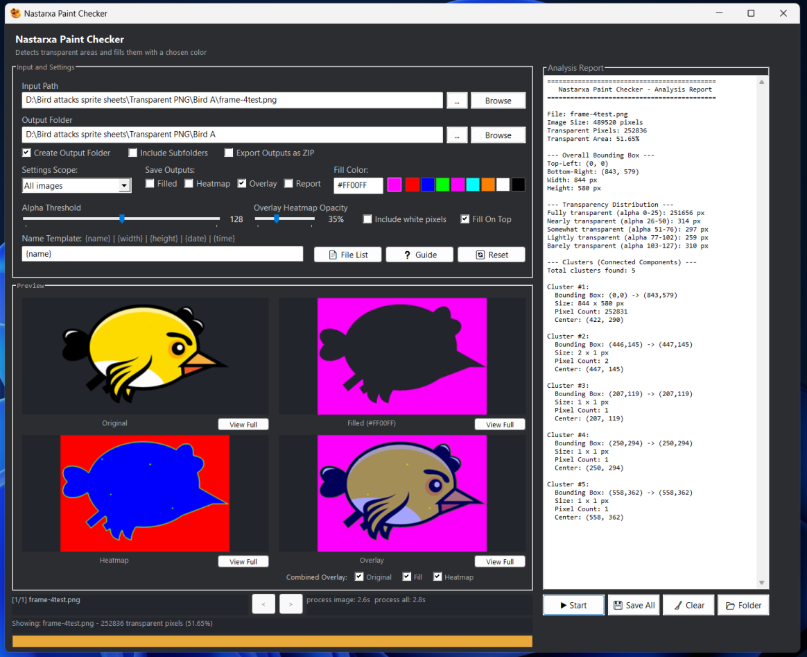
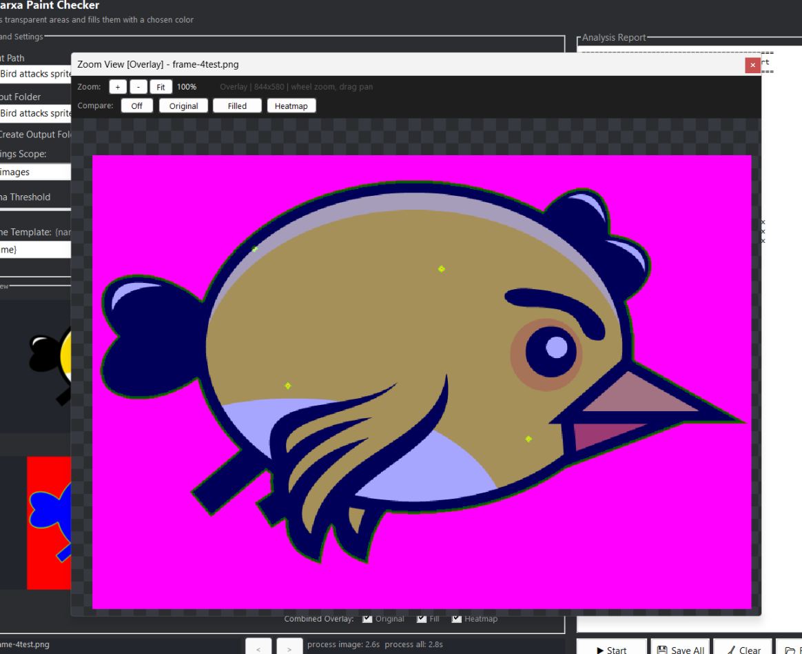
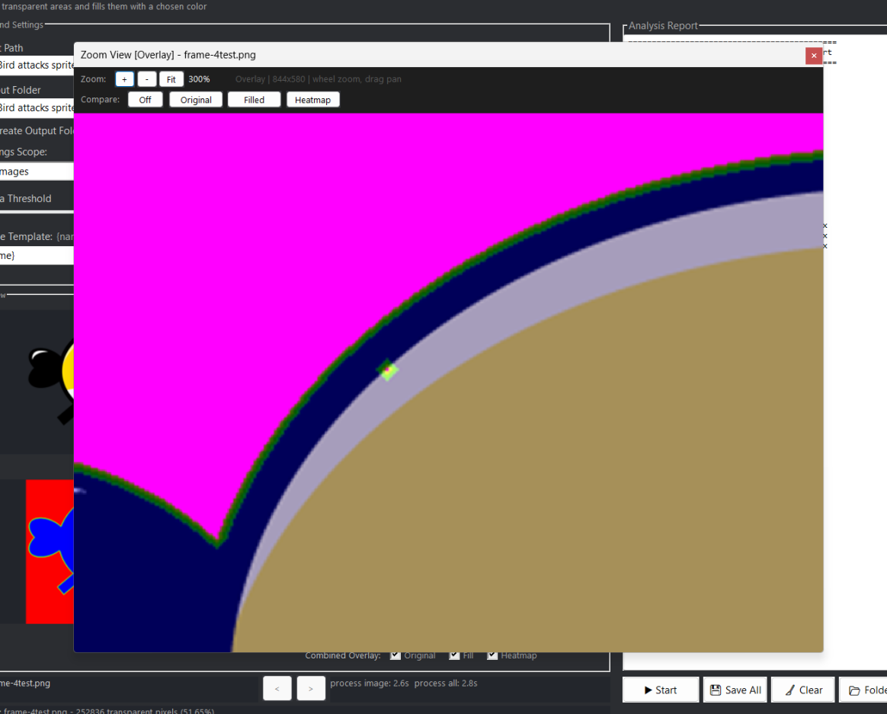
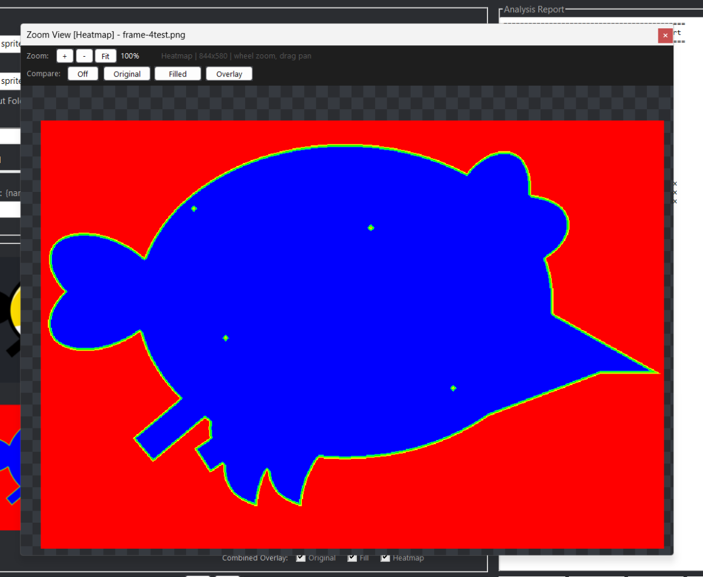
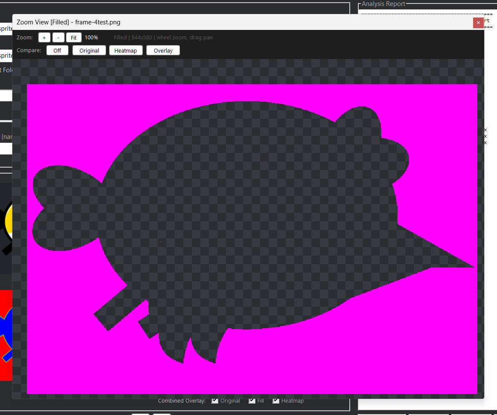

# 🎨 Nastarxa Paint Checker

Detect transparent (alpha) pixels in images and generate visual markers, heatmaps, overlays, and detailed analysis reports with a fully customizable heatmap color gradient.

Perfect for checking paint gaps, transparency leaks, missing fills, export mistakes, and cleanup issues in animation, game assets, sprites, illustrations, and texture workflows.


---

## 🖼 Image Preview







---

## ✨ Features

### 🔍 Transparency Detection

Quickly identify transparent pixels using an adjustable Alpha Threshold (0–255).

### 🎨 Filled Output

Generate a transparency mask using a custom fill color.

* User-defined hex color
* Built-in color presets
* Optional Fill On Top mode

### 🌡️ Heatmap Output

Visualize transparency density using a customizable 7-color gradient (fill, edge1–5, far):

- Click **Heatmap Colors** to open the color editor
- 10 built-in presets (Default, Hot, Cool, Rainbow, Monochrome, Fire, Ocean, Sunset, Forest, Plasma)
- Live-editable hex color inputs with real-time swatches
- Gradient preview bar in both the dialog and main GUI

The gradient bar also appears in the main GUI above the Heatmap Colors button, updating live when you save changes.

### 🖼️ Overlay Output

Combine multiple views into a single image:

1. Original image
2. Heatmap layer
3. Fill markers

Overlay opacity is fully adjustable.

### 📊 Detailed Analysis Report

Generate a text report containing:

* Transparent pixel count
* Coverage percentage
* Bounding box information
* Alpha distribution
* Connected-component cluster analysis

### 📁 Batch Processing

Process:

* Single images
* Multiple images
* Entire folders
* Recursive subfolders

### 🔎 Advanced Preview Window

Double-click any preview to open:

* Mouse-wheel zoom
* Drag panning
* Side-by-side comparison mode

### 💾 Flexible Export

Choose which outputs to save:

* Filled
* Heatmap
* Overlay
* Report

Optional ZIP export is also available.

### ⏱️ Progress Tracking

Batch processing includes:

* Progress bar with per-file sub-progress
* Current file information and ETA
* Per-image processing time display

Single-image **Refresh** also shows:

* Progress bar during processing
* Image processing duration on completion
* Status notifications and dirty-state indicator (orange "Apply!" button)

### 🚀 No External Dependencies

Supports TGA files natively.

---

## 🖼️ Generated Outputs

| Output  | Description                                             |
| ------- | ------------------------------------------------------- |
| Filled  | Highlights transparent pixels using a custom fill color |
| Heatmap | Visualizes transparency density using a color gradient  |
| Overlay | Combines original image, heatmap, and fill markers      |
| Report  | Detailed transparency statistics and cluster analysis   |

---

## 📂 Supported Formats

```text
PNG
JPG
JPEG
BMP
TIFF
TIF
TGA
```

---

## ⚙️ Requirements

* Windows 7 or newer
* AutoHotkey v2 (source version only)

---

## 🚀 Quick Start

1. Launch Nastarxa Paint Checker.
2. Drop image files or folders into the window.
3. Adjust Alpha Threshold if needed.
4. Customize fill color (right column) and heatmap gradient (center column) if desired.
5. Select which outputs to generate (left column).
6. Click **Start** to batch process, or **Refresh** (turns orange when settings change) for the current image.
7. Review previews and analysis results.
8. Save outputs individually or export as ZIP.

---

## 📤 Output Location

Generated files are saved:

* Beside the original image

or

* Inside a `_paint_check_output` folder when enabled

---

## ⚡ Performance

Nastarxa Paint Checker is optimized for large images and batch operations.

Techniques used include:

* GDI+ LockBits pixel access
* Direct memory processing
* Multi-pass distance transforms
* Optimized flood-fill cluster detection
* Byte-array visited buffers

---

## 📜 License

MIT
See [LICENSE](/LICENSE).

---

## ⚠️ Disclaimer

This project was developed with the assistance of AI tools.
AI was used to support code writing, refactoring, and documentation, while the design direction, features, and final implementation were guided and reviewed by the author.
